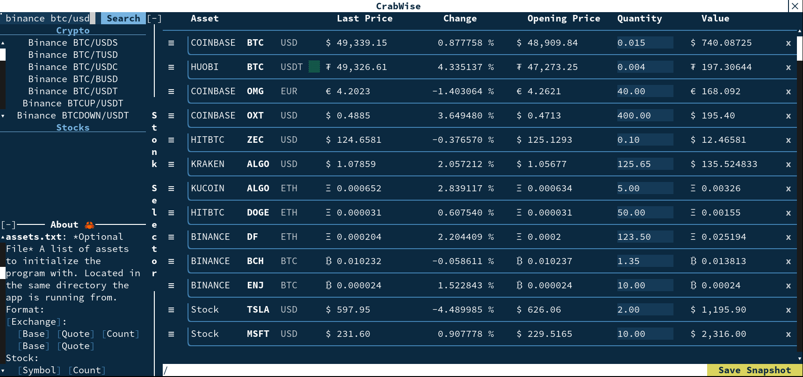

# CrabWise 🦀

Crypto and US Stock Viewer in the Terminal.

Supports Coinbase, KuCoin, Kraken, HitBTC, Binance, ZB, Huobi, Poloniex, Gemini,
and Bitfinex as well as stocks from NYSE and Nasdaq.

<p align="center">
  
</p>

## Instructions

Create a directory to store your CrabWise data.

Register for a Finnhub API key [here](https://finnhub.io/), and place the key in
a file named `finnhub.key` in the same directory that CrabWise runs from.

`cd` to your directory and run `./crabwise`.

Search for assets to add by expanding the sidebar and using the search bar,
click on assets to add them, x to delete them.

Type in quantities of each asset you own.

Click on the `Save Snapshot` button in the bottom right corner. Data is stored
in plaintext and is loaded next time the app is opened.

## `assets.txt`

This file does not have to be created manually, starting CrabWise for the first
time, adding assets from the search bar, and saving will create this file. This
file is overwritten each time 'Save Snapshot' is clicked.

This is the file your data is stored in, it has a simple format. `#` starts a
comment, has to be on its own line. Exchanges can be listed multiple times, the
order listed is the order read into the program. Quantities are optional. Any
number of whitespace is used a separator. Base currency is listed first, then
the currency it is quoted in on the exchange. Stocks are listed with the literal
'Stocks' header.

```txt
Coinbase:
    BTC  USD Quantity
    AAVE USD Quantity
    GRT  USD Quantity

Binance:
    BTC USDT Quantity
    BNB BTC  Quantity

# Comment

Stock:
    MSFT Quantity
    TSLA Quantity
```

Use with a Terminal that supports True Color.
