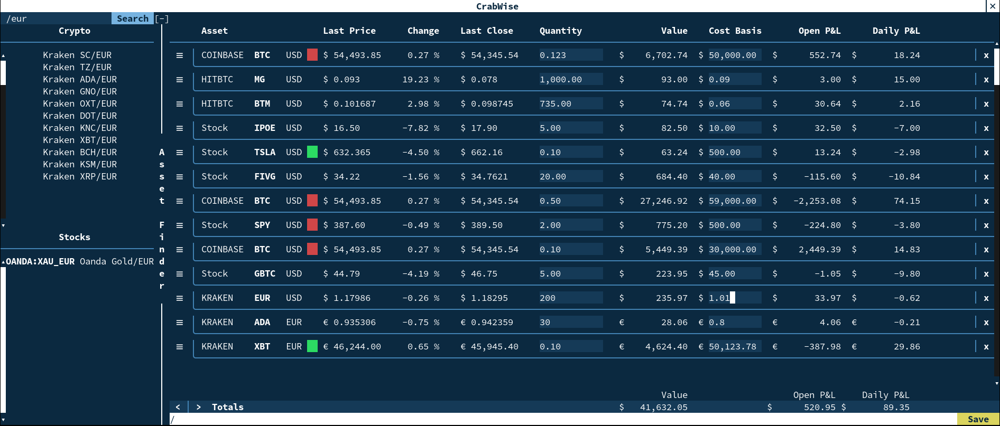

# CrabWise 🦀

Crypto and US Stock Viewer in the Terminal.

Supports Coinbase, KuCoin, Kraken, HitBTC, Binance, ZB, Huobi, Poloniex, Gemini,
and Bitfinex as well as stocks from NYSE and Nasdaq.

<p align="center">
  
</p>

## Build Instructions

This project uses git submodules and cmake to compile. It should build on Linux
and MacOS.

It requires OpenSSL and Boost Static Libraries being installed on your system.
Modify the `CMakeLists.txt` files if you want to link to the dynamic versions of
these libraries.

```sh
git clone https://github.com/a-n-t-h-o-n-y/CrabWise.git
cd CrabWise/
mkdir build && cd build/
cmake .. -DCMAKE_BUILD_TYPE=Release
make crabwise    # Build the app locally
make install     # Optional install to gnu default directories(TODO - not yet)
```

## Instructions

You'll need to register for a free Finnhub API key [here](https://finnhub.io/)
in order to get live data for most markets.

When the app is run for the first time, you'll pass in your Finnhub API key via
the command line, the application will remember this on subsequent startups, and
can be replaced anytime by passing a new key via the command line.

All data is stored in the `~/Documents/crabwise/` directory. You'll find a few
files here:

- `finnhub.key`: Your Finnhub API Key

- `assets.txt`: Store of your current assets, saved on `Save` button press.

- `crabwise.log`: Status and Error logs, if having network issues, look here.

Once the app is up and running, you can search for assets by expanding the
sidebar and using the search bar. Click on an asset to add it, x to delete it.

You can then type in the quantity of the asset you own under the `Quantity`
column, which will update the `Value` column and will be stored in `assets.txt`.

Click on the `Save` button in the bottom right corner. This will save the
current state of the app, so it can be reloaded later.

## `assets.txt` Format

This is the file your data is stored in, it has a simple format. `#` starts a
comment, has to be on its own line. Exchanges can be listed multiple times, the
order listed is the order read into the program. Quantities are optional. Any
number of whitespace is used a separator. Base currency is listed first, then
the currency it is quoted in on the exchange. Stocks are listed with the literal
'Stocks' header.

```txt
Coinbase:
    BTC  USD Quantity
    AAVE USD Quantity
    GRT  USD Quantity

Binance:
    BTC USDT Quantity
    BNB BTC  Quantity

# Comment

Stock:
    MSFT Quantity
    TSLA Quantity
```

Use with a Terminal that supports True Color.

Make sure ssl certificates are installed on your system in the usual locations.
OpenSSL via homebrew installs these on MacOS, and `ca-certificates` package on
linux.
